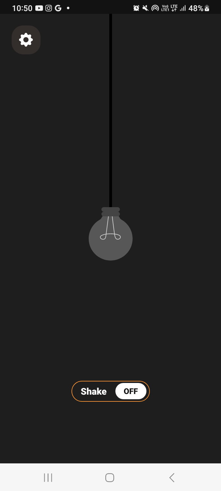
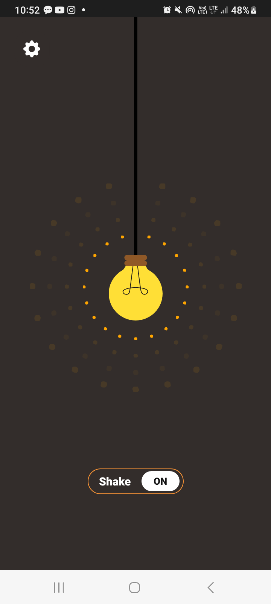

# FlashlightMine


[](https://f-droid.org/packages/com.samyak2403.flashlightmine)
[](https://github.com/samyak2403/FlashLightmine/releases/latest)


FlashlightMine is an Android application that allows users to toggle their device flashlight using a button or by shaking the device. The app provides a simple and interactive UI for this purpose.

## Features

- **Flashlight Control**: Turn the flashlight ON/OFF with a button.
- **Pull Rope Interaction**: Drag the lightbulb or line like a pull-cord switch to toggle the flashlight with realistic spring animations.
- **Shake Detection**: Shake your device to toggle the flashlight.
- **Interactive Tutorial**: A spotlight tutorial guides first-time users on how to use the pull-to-toggle feature.
- **Dynamic UI**: 
  - Changes the background color and light bulb icon based on flashlight status.
  - Updates the status bar color dynamically.
  - Applies dynamic tint to UI elements for better visual feedback.
- **Snackbar Notifications**: Inform users about additional functionalities.

## Screenshots

<table style="width: 100%; text-align: center; border-collapse: collapse;">
  <tr>
    <td></td>
    <td></td>
    <td></td>
  </tr>
 
</table>
    
## Getting Started

### Prerequisites

- Android Studio installed on your computer.
- A device with a flashlight and accelerometer sensor (or an emulator with simulated hardware).

### Installation

1. Clone this repository:
   ```bash
   git clone https://github.com/samyak2403/FlashLightmine.git
   ```

2. Open the project in Android Studio.
3. Build and run the project on a compatible Android device or emulator.

## Code Overview

### MainActivity

The primary activity handles the following:

1. **Flashlight Control**:
   - Toggles the flashlight using the `CameraManager` API.
   - Updates the UI to reflect the flashlight status.

2. **Pull Rope Animation**:
   - Implements a drag-and-release mechanic using `OnTouchListener`.
   - Uses `SpringAnimation` for realistic bounce-back effects.
   - Stretches the rope (`line_5`) and moves the lightbulb in sync for a fluid physics-based feel.

3. **Showcase Tutorial**:
   - Displays a feature discovery overlay using `TapTargetView` on the first launch.

4. **Shake Listener**:
   - Uses the accelerometer sensor to detect device shakes.
   - Toggles the flashlight if a shake is detected above the threshold (2.5 G).

5. **Dynamic UI Updates**:
   - Changes background color and status dynamically.
   - Updates the tint of decorative ellipses based on flashlight state.

### Key Functions

- `toggleFlashlight()`: Toggles the flashlight and updates the UI.
- `setupPullRopeAnimation()`: Configures touch listeners and physics-based animations for the pull-cord interaction.
- `snapBackWithSpring()`: Handles the spring snap-back animation for the rope and bulb.
- `showTutorialIfFirstLaunch()`: Checks shared preferences to display the onboarding tutorial once.
- `setupShakeListener()`: Registers a sensor listener to detect shakes.
- `setEllipsesTint(isFlashlightOn: Boolean)`: Updates the tint of UI ellipses.

## Dependencies

This app uses the following Android libraries:

- [Material Components](https://material.io/develop/android) for Snackbar and UI design.
- [Camera2 API](https://developer.android.com/reference/android/hardware/camera2/package-summary) for flashlight control.
- [Dynamic Animation](https://developer.android.com/jetpack/androidx/releases/dynamicanimation) for spring physics animations.
- [TapTargetView](https://github.com/KeepSafe/TapTargetView) for feature discovery tutorials.

## Permissions

Add the following permissions in your `AndroidManifest.xml` file:

```xml
<uses-permission android:name="android.permission.CAMERA" />
<uses-permission android:name="android.permission.FLASHLIGHT" />
```

## How to Use

1. Launch the app.
2. **Pull the Rope**: specificially, drag the lightbulb down and release it to toggle the flashlight.
3. Tap the ON/OFF button to toggle the flashlight.
4. Shake your device to toggle the flashlight dynamically.

## Future Enhancements

- Add customization for shake sensitivity.
- Include more dynamic animations for better user interaction.

## Author

[Samyak Kamble](https://github.com/samyak2403/)

## License

This project is licensed under the MIT License - see the [LICENSE](LICENSE) file for details.
